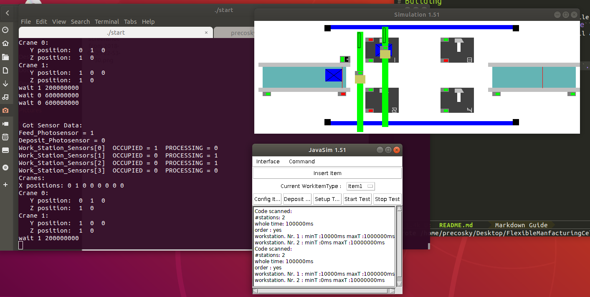

# Introduction

This was a fourth year real-time system engineering class project from 2004. The
task was to write a multithreaded control system for a pair of robots on a
single gantry that pick up work items from a input conveyor, place them in work
cells for the required time, then place them on an output conveyor.

The two robots can't cross over each other.

The conveyors can be started and stopped, and there are photoelectric sensors
for detecting the presnce of objects on conveyors and work cells.

The original project documentation showing its underlying design can be seen at [OriginalDocs](http://htmlpreview.github.io/?https://github.com/alex-precosky/FlexibleManufacturingCell/blob/master/doc/index.html)



# Acknoledgements

Sid Fels from the Electical & Computer Engineering at UBC for the java based
simulator and the flexInterface library that allows the controller to interface
with the simulator.

And the development team of the controller:

| Name |
|---|
| Alex Precosky |
| Brian Dowling |
| Mehdi Bahrami |
| Navid Boostani |


# Prerequisites

This probably only works on Unix-like OSs. It was originally done for some
unknown linux distro in 2004, and was recently tested in Ubuntu 18.04. It
probably also works in macOS.

* GNU Make
* gcc
* Posix threads library
* Java SE Develoment Kit, at least whatever version as was out in 2004

# Building

GNU Autotools manage the generation of the Makefile.  From the *src*
subdirectory, run ```./configure``` then ```make```.  The java simulator,
flexInterface library, and the control system will all be built.

# Running

From the *src/ControlSystem* subdirectory, run ```./start```

